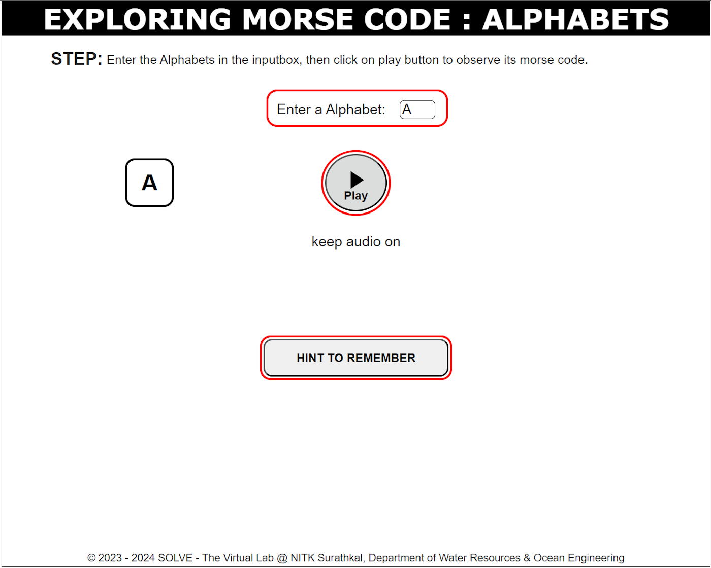
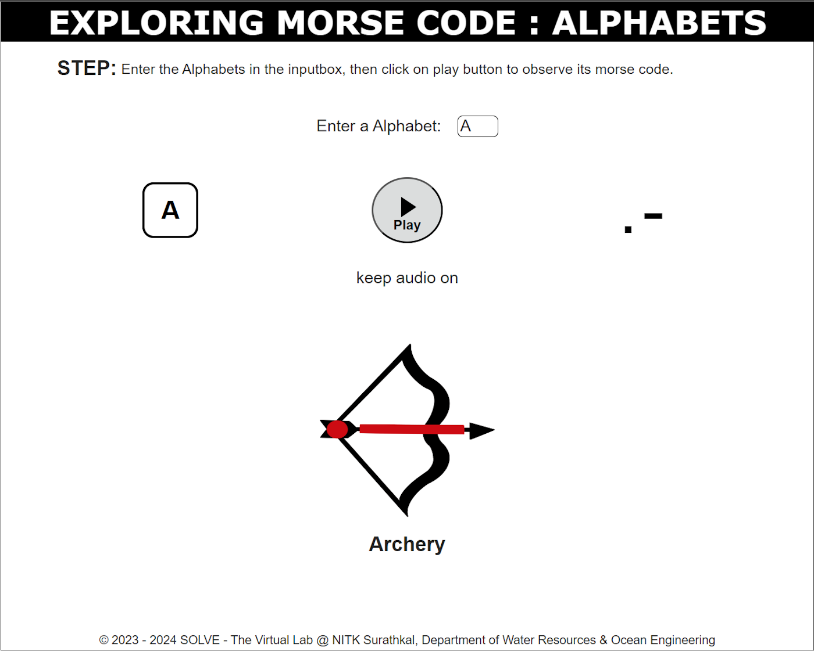

### These procedure steps will be followed on the simulator  
1. Open the Alphabets simulation and go through the Objective and Description, then click the 'NEXT' button in the bottom right corner.

2.Enter any letter (A to Z) and click 'Play' to generate its Morse code. Use 'Hint to remember' to make it easier to remember the morse code.

3.After clicking the "Play" and "Hint to Remember" buttons, the results will appear. To explore other Morse code alphabets, simply enter a new letter in the input box.

