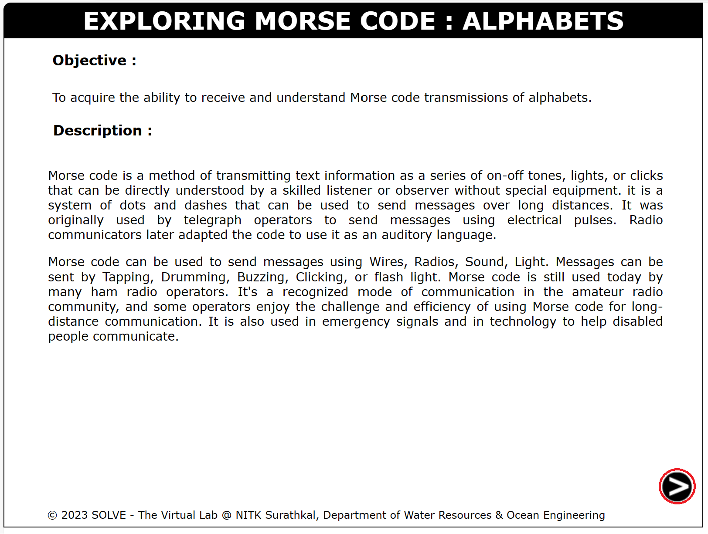
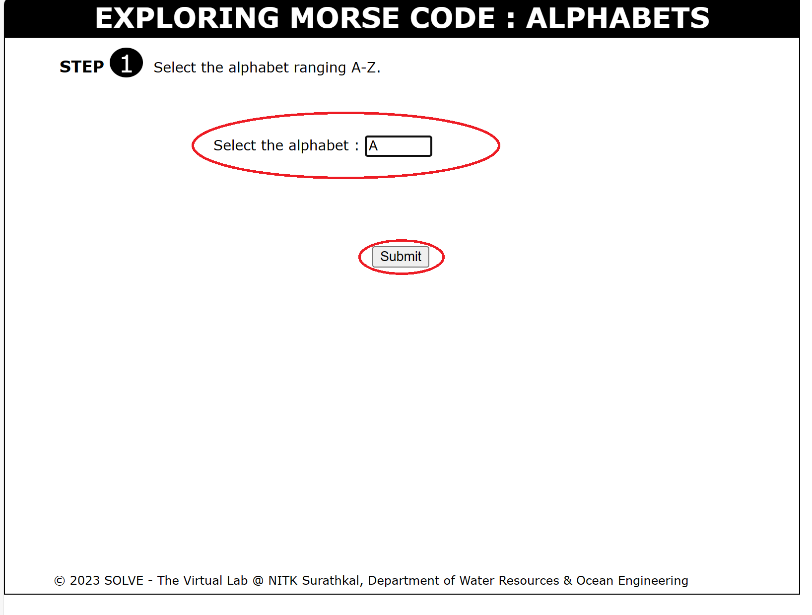
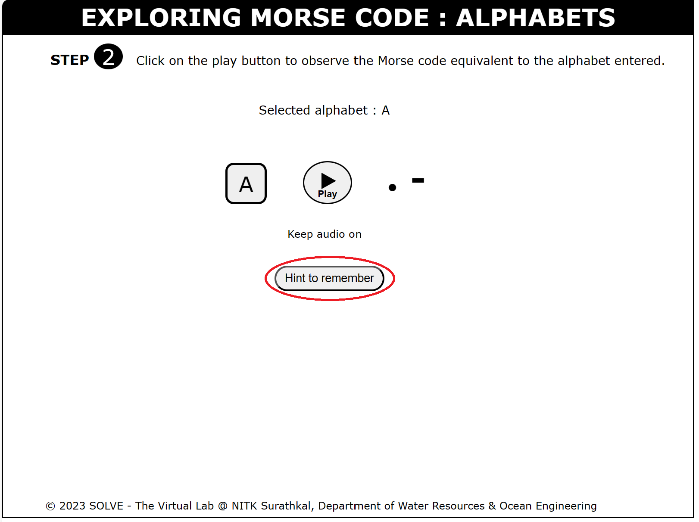
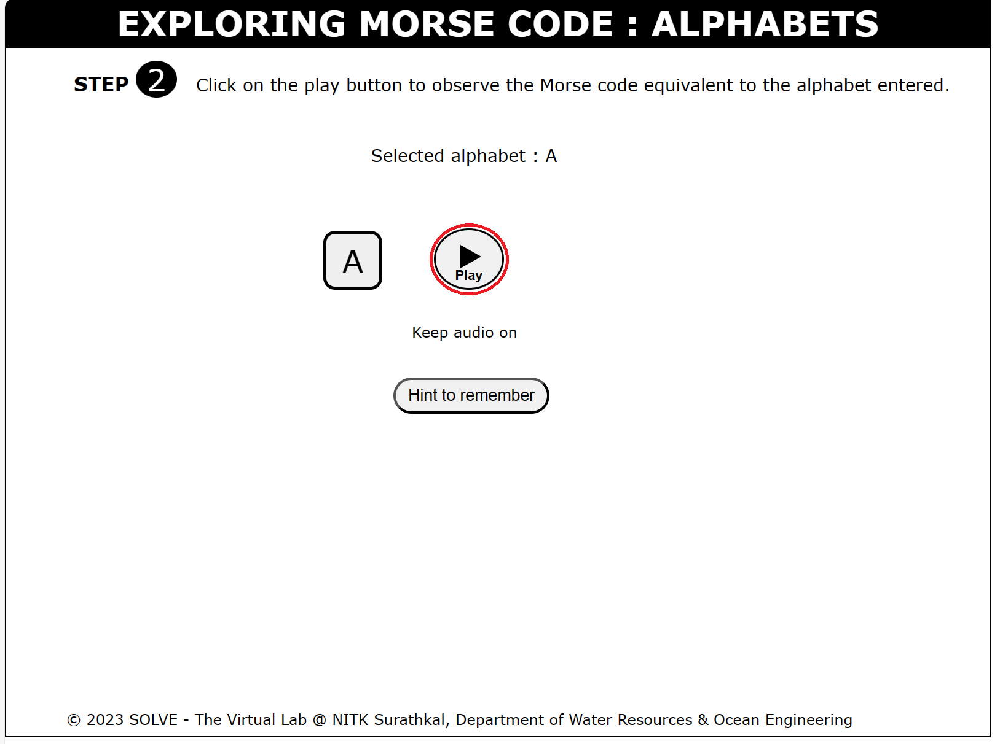
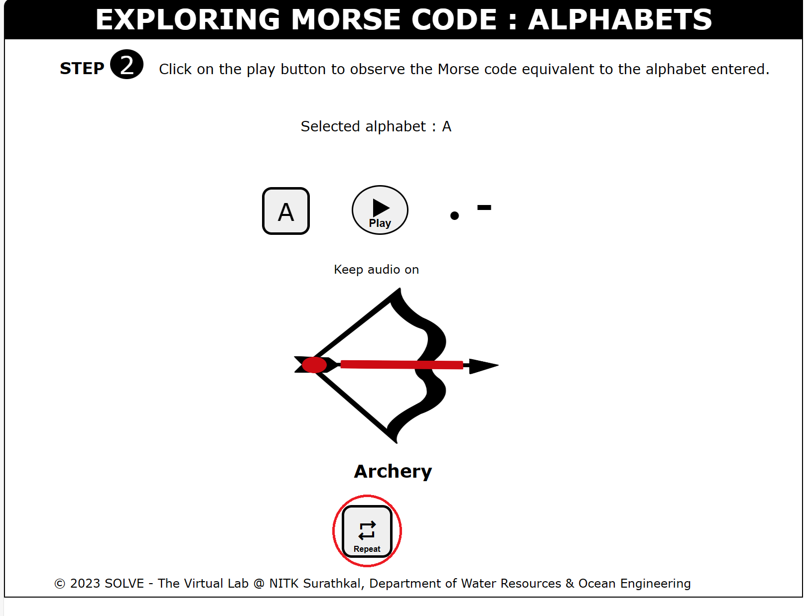

### These procedure steps will be followed on the simulator  
1.Open the simulation of Alphabets by navigating through the
introductory paragraph, and then proceed by selecting the
“NEXT” button located in the bottom right corner.

2.Enter the alphabet ranging from A to Z and then click the submit
button

3.Click on the “Play” button to generate the Morse Code with a tone
equivalent to the selected alphabet.

4.To make it easier to remember the Morse Code by displaying images,
click on the Hint to remember button.

5.To go back to step1 click on the repeat button.

